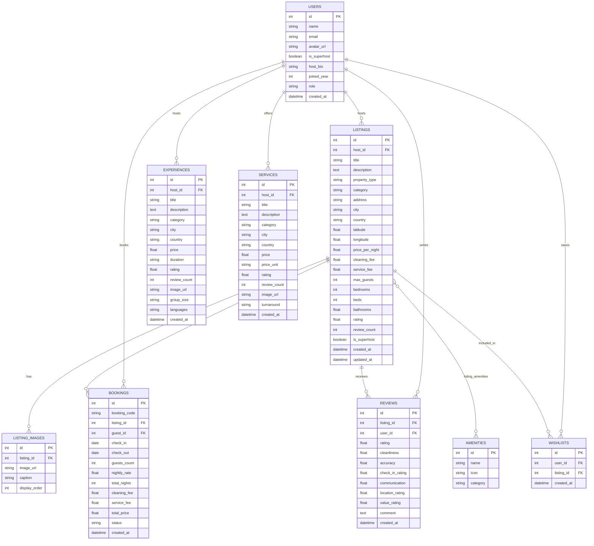

#  Airbnb Clone — Fullstack SDE Web Application

A fullstack clone of the Airbnb web application replicating Airbnb's design, user experience, and core booking workflows. Built with **Next.js (TypeScript)** on the frontend, **Python FastAPI** on the backend, and **SQLite** with SQLAlchemy ORM.

---

##  Key Features

### 1. Home & Explore
- **Iconic Airbnb Navigation**: Floating compact search pill expanding into interactive Destination / Date Range / Guest stepper picker.
- **Category Filter Carousel**: Smooth horizontal scrollable category icons bar (Amazing pools, Beachfront, Cabins, Mansions, Luxe, Iconic cities, Lakefront, Countryside, Tropical, Design, Treehouses) with live listing counts.
- **Filter Modal**: Filter by nightly price range ($ min / $ max), property type (Entire place, Private room), bedroom counts, and specific amenities (Wifi, Pool, Kitchen, Hot tub, AC, EV charger, etc.).
- **Photo Carousel Cards**: Listing cards featuring multi-photo navigation dots, heart wishlist toggle with micro-animations, Superhost/Guest Favorite badges, and total-before-taxes price toggling.
- **Interactive Map Mode**: Toggle between Grid View and an Interactive Map with custom price pill markers (`$485`, `$295`, `$650`) and popup preview cards.

### 2. Listing Detail Page
- **Signature 5-Photo Gallery Grid**: 1 hero view on the left, 4 smaller views on the right, plus a full-screen photo gallery modal.
- **Complete Property Metadata**: Title, host bio, Superhost badge, property highlights, bed/bathroom counts, and sleeping arrangements.
- **Amenities Modal**: Comprehensive grid of amenities categorized with custom icons.
- **Interactive Availability Calendar**: Visual check-in/check-out range picker with real-time disabled/blocked date validation.
- **Sticky Reservation Card**: Live price breakdown ($ nightly × nights + cleaning fee + Airbnb service fee), guest picker, and direct Reserve button.
- **Reviews & Sub-Scores**: Cleanliness, Accuracy, Communication, Location, Check-in, and Value sub-ratings, plus guest reviews list.
- **Leave a Review (Bonus)**: Interactive modal to write feedback and rate 1–5 stars with automatic recomputation of the listing's average rating.

### 3. End-to-End Booking Flow
- **Conflict Prevention**: Validates overlapping dates against existing confirmed reservations directly in the database (returns HTTP 409 if unavailable).
- **Checkout & Confirmation**: Summary receipt, date review, guest selector, and mock payment methods (Credit card, PayPal, Apple Pay).
- **My Trips Dashboard (`/trips`)**: Displays active and past reservations with unique confirmation codes (e.g. `HM-BAOP8746`), stay dates, total paid, and a **"Cancel stay"** action that immediately releases blocked dates in the database.

### 4. Host Experience (Full CRUD)
- **Host Dashboard (`/host`)**: Real-time analytics metrics (Total Listings, Total Bookings, Earned Revenue, Average Rating).
- **Create Listing (`/host/create`)**: Multi-section publishing form with curated photo preset bundles (Villa, Alpine Chalet, Coastal Beach) or custom URLs, amenities selector, and pricing rules.
- **Edit Listing (`/host/edit/[id]`)**: Pre-populated update form to modify titles, descriptions, pricing, capacity, and photos.
- **Delete Listing**: Confirmation modal with cascade deletion of listing images and relationships.
- **Incoming Reservations**: Host view of all incoming guest bookings with guest names, check-in/out dates, and total payouts.

### 5. Airbnb Experience & Demo Persona Switcher
- **Demo User Switcher**: Switch between **Alex Rivers (Guest)**, **Sarah Jenkins (Superhost)**, and **Marco Rossi (Host)** with a single click in the user menu.
- **Wishlists (`/wishlists`)**: Fast optimistic heart toggle with persistent backend database storage.
- **Experience filters**: Airbnb-style Originals, experience type, time-of-day, price, duration, language, and accessibility controls.
- **Toast Notifications**: Interactive feedback on bookings, wishlist toggles, reviews, and profile switches.
- **Responsive Mobile Navigation**: Dedicated bottom navigation bar for mobile and tablet viewports.

---

## 🛠️ Tech Stack

| Layer | Technology | Description |
|---|---|---|
| **Frontend** | **Next.js 16 (App Router)** | React 19, TypeScript, server and client components |
| **Styling** | **Tailwind CSS v4 & Vanilla CSS** | Airbnb brand tokens (`#FF385C`), custom shadows, rounded layouts |
| **Icons** | **Lucide React** | Modern, lightweight SVG iconography |
| **Backend** | **Python 3.13 + FastAPI** | High-performance asynchronous REST API with automatic OpenAPI docs |
| **Database** | **SQLite + SQLAlchemy 2.0** | Relational database with Foreign Keys, Cascades, and Many-to-Many associations |
| **Validation** | **Pydantic v2** | Strict schema validation and serialization |

---

##  Architecture Overview

```
airbnb/
├── backend/
│   ├── app/
│   │   ├── __init__.py
│   │   ├── database.py       # SQLite engine, sessionmaker, Base, get_db dependency
│   │   ├── models.py         # SQLAlchemy ORM models (User, Listing, Booking, etc.)
│   │   ├── schemas.py        # Pydantic v2 request & response schemas
│   │   ├── main.py           # FastAPI application, CORS middleware, lifespan events
│   │   └── routers/
│   │       ├── listings.py   # Full search, filters, CRUD endpoints
│   │       ├── bookings.py   # Booking flow, conflict checking, My Trips
│   │       ├── host.py       # Host dashboard metrics & incoming reservations
│   │       ├── reviews.py    # Review submission & rating recomputation
│   │       ├── wishlists.py  # User favorites toggle & retrieval
│   │       ├── users.py      # Demo persona switcher
│   │       ├── categories.py # Categories with live counts
│   │       └── amenities.py  # Standard amenities list
│   ├── seed.py               # Seeds 16 global listings, users, reviews, bookings
│   ├── requirements.txt      # Python dependencies
│   └── airbnb.db             # SQLite database file
├── frontend/
│   ├── src/
│   │   ├── app/
│   │   │   ├── layout.tsx              # Root layout with Navbar, Footer, MobileNav, Toasts
│   │   │   ├── page.tsx                # Home explore page (grid & map view)
│   │   │   ├── listings/[id]/page.tsx  # Detail page (5-photo grid, calendar, sticky card)
│   │   │   ├── book/[id]/page.tsx      # Booking checkout confirmation
│   │   │   ├── trips/page.tsx          # My Trips view & cancel reservation
│   │   │   ├── wishlists/page.tsx      # Saved accommodations
│   │   │   └── host/
│   │   │       ├── page.tsx            # Host dashboard & analytics
│   │   │       ├── create/page.tsx     # Create listing form
│   │   │       └── edit/[id]/page.tsx  # Edit listing form
│   │   ├── components/
│   │   │   ├── Navbar.tsx              # Airbnb header & user persona dropdown
│   │   │   ├── CategoriesBar.tsx       # Horizontal category icons bar
│   │   │   ├── SearchBarExpanded.tsx   # Destination, dates, and guest picker
│   │   │   ├── FilterModal.tsx         # Comprehensive filters dialog
│   │   │   ├── ListingCard.tsx         # Carousel card with wishlist heart
│   │   │   ├── InteractiveMap.tsx      # Interactive map with clickable price pins
│   │   │   ├── ToastContainer.tsx      # Notification toasts
│   │   │   ├── Footer.tsx              # Airbnb footer
│   │   │   └── MobileBottomNav.tsx     # Mobile viewport navigation
│   │   ├── context/
│   │   │   └── AppContext.tsx          # Global state for users, wishlists, toasts, filters
│   │   ├── lib/
│   │   │   └── api.ts                  # Typed client for backend REST API
│   │   └── types/
│   │       └── index.ts                # TypeScript interfaces
│   ├── package.json
│   └── tsconfig.json
└── README.md
```

---

## 🗄️ Database Schema (ERD)

The SQLite database (`airbnb.db`) uses normalized relational tables:



---

##  Getting Started

### Prerequisites
- **Node.js** v18+ (tested on Node v20.14.0)
- **Python** 3.10+ (tested on Python 3.13)
- **Git**

---

### Step 1: Backend Setup (FastAPI & SQLite)

1. Open a terminal and navigate to the `backend/` folder:
   ```bash
   cd backend
   ```

2. Create and activate a Python virtual environment:
   - **Windows PowerShell**:
     ```powershell
     python -m venv venv
     .\venv\Scripts\Activate.ps1
     ```
   - **macOS / Linux**:
     ```bash
     python3 -m venv venv
     source venv/bin/activate
     ```

3. Install required dependencies:
   ```bash
   pip install -r requirements.txt
   ```

4. Seed the SQLite database with 16 world-class listings, users, amenities, reviews, and bookings:
   ```bash
   python seed.py
   ```
   By default the database is `backend/airbnb.db`. Set `AIRBNB_DATABASE_URL` before starting the API to use a different SQLAlchemy database URL (for example, `sqlite:///./test.db` for an isolated local test database).

5. Start the FastAPI development server:
   ```bash
   python -m uvicorn app.main:app --host 127.0.0.1 --port 8000 --reload
   ```

   - **Backend API URL**: [http://127.0.0.1:8000](http://127.0.0.1:8000)
   - **Interactive OpenAPI Documentation (Swagger UI)**: [http://127.0.0.1:8000/docs](http://127.0.0.1:8000/docs)
   - **Alternative ReDoc**: [http://127.0.0.1:8000/redoc](http://127.0.0.1:8000/redoc)

---

### Step 2: Frontend Setup (Next.js & TypeScript)

1. Open a new terminal and navigate to the `frontend/` folder:
   ```bash
   cd frontend
   ```

2. Install dependencies:
   ```bash
   npm install
   ```

3. Start the Next.js development server:
   ```bash
   npm run dev
   ```

4. Open your browser and visit:
   ```
   http://localhost:3000
   ```

---

## 📡 Core API Reference

| Method | Endpoint | Description |
|---|---|---|
| `GET` | `/api/listings` | Search and filter listings (`location`, `category`, `check_in`, `check_out`, `guests`, `min_price`, `max_price`, `property_type`, `amenities`, `sort_by`); pass `paginated=true&page=1&page_size=20` for page metadata |
| `GET` | `/api/listings/{id}` | Detailed property data with images, amenities, reviews, host info, and booked dates |
| `POST` | `/api/listings` | Create a new listing (Host CRUD) |
| `PUT` | `/api/listings/{id}?host_id={id}` | Update an owned listing (mock host identity) |
| `DELETE` | `/api/listings/{id}?host_id={id}` | Delete an owned listing (mock host identity) |
| `POST` | `/api/bookings/price-preview` | Calculate the stay cost and report date availability |
| `POST` | `/api/bookings` | Create a new reservation with overlapping-date and capacity checks |
| `POST` | `/api/bookings/checkout?guest_id={id}` | Idempotent mocked payment and booking confirmation |
| `GET` | `/api/bookings/my` | Retrieve current user's trips |
| `DELETE` | `/api/bookings/{id}` | Cancel reservation and release dates |
| `GET` | `/api/host/stats` | Retrieve host earnings, total listings, bookings, and avg rating |
| `GET` | `/api/host/listings` | Host listings with individual bookings count and revenue |
| `GET` | `/api/host/reservations` | All incoming reservations across host properties |
| `POST` | `/api/listings/{id}/reviews` | Post a review and dynamically recompute listing score |
| `GET` | `/api/wishlists` | Get saved wishlist listings |
| `POST` | `/api/wishlists/{id}` | Toggle listing in/out of wishlist |
| `GET` | `/api/experiences` | Search and filter experiences (`location`, `search`, `category`, `min_price`, `max_price`, `sort_by`); responses include the `is_original` flag |
| `GET` | `/api/experiences/{id}` | Detailed experience item with host details and specifications |
| `GET` | `/api/services` | Search and filter concierge/hospitality services (`location`, `search`, `category`, `min_price`, `max_price`, `sort_by`) |
| `GET` | `/api/services/{id}` | Detailed service offering with host info and turnaround time |
| `GET` | `/api/search` | Unified search across stays, experiences, and services (`q`, `location`, `tab`, filters) |
| `GET` | `/api/categories` | Categories list with live counts |
| `GET` | `/api/amenities` | Master list of all amenities |
| `GET` | `/api/users` | Demo persona list for testing roles |

---

##  Automated Testing Suite

A comprehensive 10-suite automated backend verification script is included to validate the entire backend without requiring manual clicks:

```bash
cd backend
python test_backend.py
```

### Verified Test Suites:
1. **Precise City Search**: Searching `"Paris"`, `"Tokyo"`, `"Dubai"`, `"Goa"`, `"London"` returns only relevant listings in those destinations.
2. **Category & Price Filters**: Verifies category matching (`Beachfront`, `Luxe`, etc.) and nightly rate bounds (`$200 – $400`).
3. **Double-Booking & Conflict Check**: Confirms that overlapping booking dates return `409 Conflict`.
4. **My Trips Flow**: Booking creation, confirmation code generation (`HM-...`), retrieval in `/api/bookings/my`, and cancellation releasing blocked dates.
5. **Host CRUD**: Full listing lifecycle (Creation -> Retrieval -> Update -> Deletion) and host metrics calculation.
6. **Reviews & Rating Recalculation**: Submitting ratings re-calculates listing score dynamically.
7. **Wishlists Persistence**: Toggle in/out of favorites persisted per-user in SQLite.
8. **Dynamic Experiences API**: City/category query for experiences (e.g. Desert Dune Buggy in Dubai, Tea Ceremony in Tokyo).
9. **Dynamic Services API**: Service search by keyword (Private Chef, Chauffeur, Massage) and city.
10. **Unified Search**: Single search entrypoint returning coordinated stays, experiences, and services.

---

